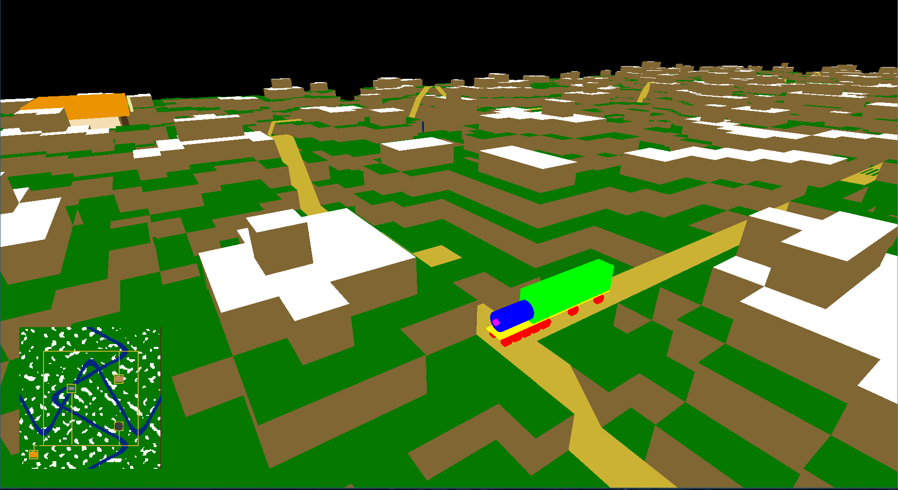

# Train Delivery



A 3D train simulation game developed for the **Elements of Computer Graphics (EGC)** course.

The player controls a train traveling through a procedurally generated world. The objective is to complete a sequence of deliveries by navigating the railway network, visiting the required locations, and delivering the correct resources before the time limit expires.

The project is implemented in **C++ using OpenGL** and is built on top of the EGC GFX Framework.

## Gameplay

The player controls a train that travels through a railway network generated on a procedurally generated terrain.

During the game, the player must:

- Navigate the railway network.
- Change direction at intersections.
- Visit different stations.
- Deliver the requested resources.
- Avoid taking incorrect routes.
- Complete all deliveries before the timer expires.

A new delivery sequence is generated after completing the required deliveries.

The game ends when the time limit is reached, at which point a **Game Over** screen is displayed.

## Controls

### Train Controls

```text
W – move forward
A – turn left
D – turn right
```

The train normally follows the railway automatically. When reaching an intersection, the player can choose the direction in which the train should continue.

### Camera Controls

Hold the **right mouse button** to control the camera:

```text
W – move forward
A – move left
S – move backward
D – move right
Q – move down
E – move up
```

The mouse is used to rotate the camera while the right mouse button is held.

## Main Features

### Procedural Terrain

The world is generated procedurally using the `WorldGen` module.

The terrain generation system contains:

- `BlockWorld`
- `WorldGeneration`
- `PerlinNoise`
- Special terrain generation

The generated terrain is used as the foundation for the railway network and the rest of the scene.

### Railway Network

The railway system is represented using a grid-based structure.

The train checks its neighboring railway cells to determine which directions are available. When the train reaches an intersection, the player can choose a new direction.

The train's orientation is updated depending on the selected direction, including the corresponding rotation angle.

### Train and Carriages

The scene contains a train and two additional train cars.

The train and cars are constructed procedurally from basic geometric primitives such as:

- Parallelepipeds
- Cylinders

The geometry is generated by the `DrawUtils` class.

### Stations

Several stations are placed throughout the world.

The stations represent locations where resources can be delivered. The player must visit the appropriate locations in the correct order to complete the current delivery request.

### Delivery System

At the beginning of the game, a delivery sequence is randomly generated.

The player must transport several different resources between specific locations. The available resources include:

- Wood
- Coal
- Plants

When the train reaches the appropriate location with the required resource, the delivery is completed and the next objective becomes active.

After all deliveries have been completed, a new delivery sequence is generated and the timer is reset.

### Timer

The game contains a time limit for completing the delivery sequence.

The timer is updated every frame. When the maximum time is reached, the game stops and a **Game Over** message is displayed.

### Minimap

A second camera is used to render a top-down view of the world.

The minimap provides an overview of:

- The terrain
- Railway network
- Stations
- Train

The minimap is rendered using a separate viewport and orthographic projection.

## Rendering

The project uses multiple rendering techniques provided by OpenGL.

The main scene uses a perspective camera, while the minimap uses an orthographic camera.

The rendering pipeline includes:

```text
Procedural World
      │
      ▼
Terrain Mesh
      │
      ├── Main Camera
      │       │
      │       ▼
      │   Main Scene
      │
      └── Minimap Camera
              │
              ▼
          Top-Down View
```

The main scene and minimap are rendered separately using different viewports and projection matrices.

## Shaders

The project contains two shader pipelines:

```text
shaders/
├── VertexShader.glsl
├── FragmentShader.glsl
├── DeformationVS.glsl
└── DeformationFS.glsl
```

The deformation shaders are used for animated/deformed geometry, while the standard vertex and fragment shaders are used for regular terrain and object rendering.

## Project Structure

```text
Tema2/
├── WorldGen/
│   ├── BlockWorld.cpp
│   ├── BlockWorld.h
│   ├── PerlinNoise.cpp
│   ├── PerlinNoise.h
│   ├── Special.cpp
│   ├── Special.h
│   ├── WorldGeneration.cpp
│   └── WorldGeneration.h
│
├── shaders/
│   ├── DeformationFS.glsl
│   ├── DeformationVS.glsl
│   ├── FragmentShader.glsl
│   └── VertexShader.glsl
│
├── DrawUtils.cpp
├── DrawUtils.h
├── MeshData.cpp
├── MeshData.h
├── MyCamera.h
├── Tema2.cpp
├── Tema2.h
└── Transform.h
```

The project is organized into separate components for world generation, rendering utilities, camera management, mesh generation, transformations, and the main game logic.

## Main Classes

### `Tema2`

The main class responsible for the game logic and rendering.

It handles:

- Game initialization
- Camera setup
- Terrain generation
- Train movement
- Train rotation
- Delivery management
- Timer
- Scene rendering
- Minimap rendering
- User input

The main game loop is implemented in `Update()`, while the main and minimap scenes are rendered by `DrawScene1()` and `DrawScene2()`.

### `BlockWorld`

Responsible for generating and managing the terrain and railway network.

It provides information about:

- Terrain height
- Railway cells
- Neighboring railway cells
- Terrain mesh

The terrain is generated before the main scene starts rendering.

### `DrawUtils`

Contains utility functions for generating custom meshes.

It is used to create objects such as:

- Train
- Train cars
- Stations
- Wood
- Coal
- Plants
- Other geometric objects

The objects are constructed from basic primitives and combined into larger meshes.

### `MyCamera`

Provides the camera functionality used by both the main scene and the minimap.

Two separate camera instances are used:

- A perspective camera for the main view.
- A top-down camera for the minimap.

## :sparkles: Introduction

This project is a tiny graphics framework used by the Computer Graphics Department of the Polytechnic University of Bucharest.
It is currently used as teaching and study material for a number of courses of increasing complexity

The code is cross-platform, and supports the following architectures:

-   Windows: `i686`, `x86_64`, `arm64`
-   Linux: `i686`, `x86_64`, `arm64`
-   macOS: `x86_64`, `arm64`


## :white_check_mark: Prerequisites

This section describes ***what you need to do and install*** before actually building the code.


### Install a compiler

The compiler requirements are listed below. We strongly recommend to always use the latest compiler versions.

-   Minimum:
    -   Windows: Visual Studio 2015 Update 3 with `Programming Languages -> Visual C++` checked when installing
    -   Linux: `g++` version 5
    -   macOS: `clang++` version 4

-   Recommended:
    -   Windows: Visual Studio 2022 with `Workloads -> Desktop development with C++` checked when installing
        -    When installing Visual Studio 2019 or later, double-check that you selected "Desktop development with C++". This should download and install approximately 8 GB of stuff from the Microsoft servers. If you installed Visual Studio and it only took several minutes, you probably missed this step
    -   Linux: `g++` latest
    -   macOS: `clang++` latest, by doing one of the following:
        -   for LLVM/Clang: install [`brew`](https://brew.sh/) then run `brew install llvm`
        -   for Apple Clang: install XCode


### Install an editor

We recommend the following editors:

-    Windows: Visual Studio (***not*** the same thing as Visual Studio Code)
-    Linux: Visual Studio Code
-    macOS: Visual Studio Code (***do not*** use Visual Studio for Mac, as it's discontinued)


### Install or update your graphics drivers

Use the following steps as a guideline. Detailed instructions differ across manufacturers and operating systems, and are ***not*** covered here.

-   Update the drivers for your integrated graphics processor (for example, Intel Graphics XXXX)
-   Update the drivers for your dedicated graphics card, if your computer has one:
    -   for Nvidia cards: https://www.nvidia.com/Download/index.aspx
    -   for AMD cards: https://www.amd.com/en/support

Not updating your drivers may result in the project not working, or displaying a white screen.


### Check your graphics capabilities

Graphics capabilities are decided by the combination of your computer's hardware, drivers, and operating system.

This project requires OpenGL version ***3.3 core profile, or newer*** for the simpler parts, and version ***4.3 core profile, or newer***  for the more advanced parts. If you have a computer manufactured within the last few years, you should be safe. ***If you're not sure,*** follow the steps in [this guide](docs/user/checking_capabilities.md) to find out.


### Install the third-party libraries

There are some open-source libraries that this project uses. To install them:

-   Windows: you don't need to do anything - all necessary libraries are already provided with the code

-   Linux: depending on your distribution, run one of the following scripts as superuser:
    -   Debian (Ubuntu): `./tools/deps-ubuntu.sh`
    -   Red Hat (Fedora): `./tools/deps-fedora.sh`
    -   Arch (x86_64): `./tools/deps-arch.sh`

-   macOS: install [`brew`](https://brew.sh/) then run `./tools/deps-macos.sh`


### Install the build tools

This project uses [CMake][ref-cmake]. It a nutshell, CMake does not compile source code, instead it creates files that you then use to compile your code (for example, it creates a Makefile on Linux and macOS, a Visual Studio project on Windows, and so on).

This project requires CMake ***3.16 or newer,*** however, as with the compilers, we strongly recommend that you use the latest version. To install it, follow these steps:

-   Windows:
    1.  go to the [CMake downloads page][ref-cmake-dl]
    2.  download the latest version of the file called `cmake-<VERSION>-windows-x86_64.msi`
    3.  install it

-   Linux:
    1.  use your package manager to install `cmake`
    2.  check the version using `cmake --version`
    3.  depending on the version:
        -   if it's the minimum required (see above), you're all set
        -   otherwise, run `./tools/install-cmake.sh && . ~/.profile` in a terminal

-   macOS:
    1.  run `brew install cmake`

After installation, run `cmake --version` to check that it's in your `PATH` environment variable. This should happen automatically, but if it didn't, just add it manually. Instructions on how to add an executable to your `PATH` differ across operating systems and are ***not*** covered here.


## :gear: Building

Open a terminal and go into the root folder of the project, which contains the top-level `CMakeLists.txt` file.
Do not run CMake directly from the top-level folder (meaning, do not do this: `cmake .`). Instead, make a separate directory, as follows:

1.  `mkdir build`
2.  `cd build`
3.  Generate the project:
    -   for module 1 labs (default): `cmake ..`
    -   for module 2 labs: `cmake .. -DWITH_LAB_M1=0 -DWITH_LAB_M2=1`
    -   for extra labs: `cmake .. -DWITH_LAB_M1=0 -DWITH_LAB_EXTRA=1`
    -   for none (`SimpleScene` only): `cmake .. -DWITH_LAB_M1=0`
4.  Build the project:
    -   Windows, one of the following:
        -   `cmake --build .`
        -   or just double-click the `.sln` file to open it in Visual Studio, then press `Ctrl+Shift+B` to build it
    -   Linux and macOS, one of the following:
        -   `cmake --build .`
        -   or just `make`

That's it! :tada:

***Note:*** When running the CMake generation step on Windows (meaning, `cmake ..`), you may receive errors that include the phrase `Permission denied`. If you currently have the framework on the `C:` drive, for example on the Desktop, you might not have write permissions. Experimentally, we've found that this happens on single-drive devices (meaning, for example, computers with no disk partition other than `C:`). As an alternative, move the framework on the top-level (directly in `C:`) or create another drive partition (for example `D:`) and move it there.


### Rebuilding

It's very simple to rebuild:

-   Every time you modify source code and want to recompile, you only need to follow ***the last step*** (for example, just `make` again)
-   Every time you add/remove/rename a source code file on disk, you need to follow ***the last two steps*** (for example, just `cmake .. && make` again)
-   If something goes wrong when generating the project, just delete the contents of the `build` folder, or the folder itself, then follow all the steps again


## :rocket: Running

You can run the project from an IDE, as well as standalone, from anywhere on disk. For example:

-   Windows, one of the following:
    -   `.\bin\Debug\GFXFramework`
    -   or just open the `.sln` file in Visual Studio, then press `F5` to run it

-   Linux and macOS:
    -   `./bin/Debug/GFXFramework`

To run a certain lab:

-   Go into `main.cpp`
-   Find this line:
    ```cpp
    World *world = new gfxc::SimpleScene();
    ```
-   Replace it with whatever you want to run, for example:
    ```cpp
    World *world = new m1::Lab1();
    World *world = new m2::Lab1();
    World *world = new extra::TessellationShader();
    // etc.
    ```


## :book: Documentation

All user and developer documentation can be found in the `docs` directory.

## :page_facing_up: License

This project is available under the [MIT][ref-mit] license; see [LICENSE.md](LICENSE.md) for the full license text.
This project also includes external libraries that are available under a variety of licenses; see [LEGAL.txt](LEGAL.txt)
for the full license texts and legal notices.


[ref-cmake]:            https://github.com/Kitware/CMake/
[ref-cmake-dl]:         https://github.com/Kitware/CMake/releases/
[ref-cmake-build]:      https://github.com/Kitware/CMake#building-cmake-from-scratch
[ref-mit]:              https://opensource.org/licenses/MIT


